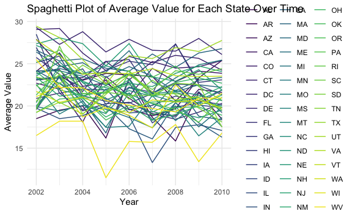
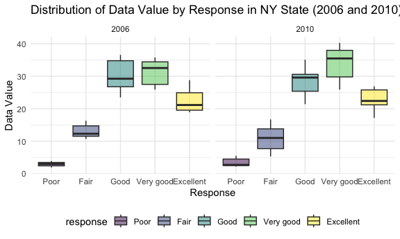
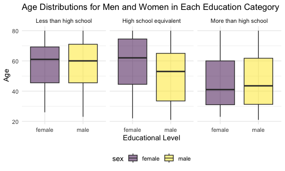
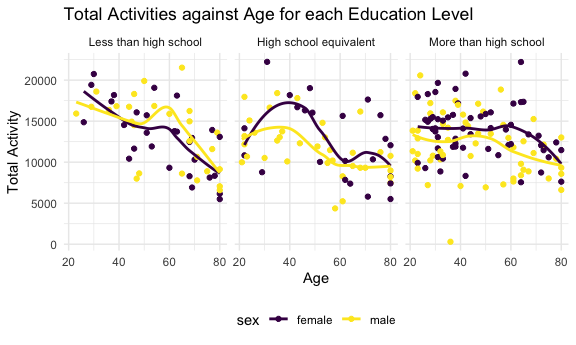
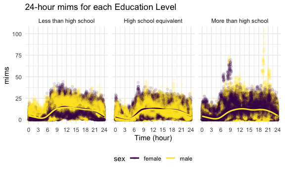

p8105_hw3_jy3360
================
Candice Yu
2023-10-05

    ## ── Attaching core tidyverse packages ──────────────────────── tidyverse 2.0.0 ──
    ## ✔ dplyr     1.1.3     ✔ readr     2.1.4
    ## ✔ forcats   1.0.0     ✔ stringr   1.5.0
    ## ✔ ggplot2   3.4.3     ✔ tibble    3.2.1
    ## ✔ lubridate 1.9.2     ✔ tidyr     1.3.0
    ## ✔ purrr     1.0.2     
    ## ── Conflicts ────────────────────────────────────────── tidyverse_conflicts() ──
    ## ✖ dplyr::filter() masks stats::filter()
    ## ✖ dplyr::lag()    masks stats::lag()
    ## ℹ Use the conflicted package (<http://conflicted.r-lib.org/>) to force all conflicts to become errors

# Problem 1

##### The goal is to do some exploration of this dataset. To that end, write a short description of the dataset, noting the size and structure of the data, describing some key variables, and giving illstrative examples of observations. Then, do or answer the following (commenting on the results of each):

``` r
library(p8105.datasets)
data("instacart")
```

###### 1.1 How many aisles are there, and which aisles are the most items ordered from?

``` r
aisles_number <- 
  instacart %>%
  group_by(aisle) %>%
  summarize(count_in_aisle = n()) %>%
  mutate(rank_of_aisle = min_rank(desc(count_in_aisle))) %>%
  arrange(rank_of_aisle)
```

<span style="color: blue;"><b>Solution 1.1:</b></span> There are 134
aisles and fresh vegetables is the aisle with the most items ordered
from.

###### 1.2 Make a plot that shows the number of items ordered in each aisle, limiting this to aisles with more than 10000 items ordered. Arrange aisles sensibly, and organize your plot so others can read it.

``` r
instacart %>%
  group_by(aisle) %>%
  summarize(count_in_aisle = n()) %>%
  arrange(count_in_aisle)%>%
  filter(count_in_aisle > 10000) %>%
  ggplot(aes(x = reorder(aisle, -count_in_aisle), y = count_in_aisle)) + 
  geom_bar(stat = "identity", alpha = .75) +
  labs(                                             
    title = "Number of Items Ordered in Each Aisle (Aisles >10,000 items)",
    x = "Aisle",
    y = "Number of Items Ordered",
  ) +
  theme(axis.text.x = element_text(angle = 50, hjust = 1))
```


###### 1.3 Make a table showing the three most popular items in each of the aisles “baking ingredients”, “dog food care”, and “packaged vegetables fruits”. Include the number of times each item is ordered in your table.

``` r
popular_items <- 
  instacart %>%
  filter(aisle %in% c("baking ingredients", "dog food care", "packaged vegetables fruits")) %>%
  group_by(aisle, product_name) %>%
  summarise(number_of_time = n()) %>%
  mutate(rank_of_time = min_rank(desc(number_of_time))) %>%
  arrange(rank_of_time) %>%
  filter(rank_of_time == c(1,2,3)) %>%
  arrange(desc(number_of_time))
```

    ## `summarise()` has grouped output by 'aisle'. You can override using the
    ## `.groups` argument.

    ## Warning: There were 3 warnings in `filter()`.
    ## The first warning was:
    ## ℹ In argument: `rank_of_time == c(1, 2, 3)`.
    ## ℹ In group 1: `aisle = "baking ingredients"`.
    ## Caused by warning in `rank_of_time == c(1, 2, 3)`:
    ## ! longer object length is not a multiple of shorter object length
    ## ℹ Run `dplyr::last_dplyr_warnings()` to see the 2 remaining warnings.

``` r
popular_items %>%
  knitr::kable(col.names = c("Aisle", "Product Name", "Order Count", "Rank")) 
```

| Aisle                      | Product Name                                  | Order Count | Rank |
|:---------------------------|:----------------------------------------------|------------:|-----:|
| packaged vegetables fruits | Organic Baby Spinach                          |        9784 |    1 |
| packaged vegetables fruits | Organic Raspberries                           |        5546 |    2 |
| packaged vegetables fruits | Organic Blueberries                           |        4966 |    3 |
| baking ingredients         | Light Brown Sugar                             |         499 |    1 |
| baking ingredients         | Pure Baking Soda                              |         387 |    2 |
| baking ingredients         | Cane Sugar                                    |         336 |    3 |
| dog food care              | Snack Sticks Chicken & Rice Recipe Dog Treats |          30 |    1 |
| dog food care              | Organix Chicken & Brown Rice Recipe           |          28 |    2 |
| dog food care              | Small Dog Biscuits                            |          26 |    3 |

###### 1.4 Make a table showing the mean hour of the day at which Pink Lady Apples and Coffee Ice Cream are ordered on each day of the week; format this table for human readers (i.e. produce a 2 x 7 table).

``` r
instacart %>%
  filter(product_name %in% c("Pink Lady Apples", "Coffee Ice Cream")) %>%
  group_by(product_name, order_dow) %>%
  summarise(mean_order_hour_of_day = mean(order_hour_of_day)) %>%
  pivot_wider(
    names_from = order_dow,
    values_from = mean_order_hour_of_day
  ) %>%
  knitr::kable(digits = 3) 
```

    ## `summarise()` has grouped output by 'product_name'. You can override using the
    ## `.groups` argument.

| product_name     |      0 |      1 |      2 |      3 |      4 |      5 |      6 |
|:-----------------|-------:|-------:|-------:|-------:|-------:|-------:|-------:|
| Coffee Ice Cream | 13.774 | 14.316 | 15.381 | 15.318 | 15.217 | 12.263 | 13.833 |
| Pink Lady Apples | 13.441 | 11.360 | 11.702 | 14.250 | 11.552 | 12.784 | 11.938 |

# Problem 2

###### First, do some data cleaning:

- format the data to use appropriate variable names;
- focus on the “Overall Health” topic
- include only responses from “Excellent” to “Poor”  
- organize responses as a factor taking levels ordered from “Poor” to
  “Excellent”

``` r
brfss = brfss_smart2010 %>%
  janitor::clean_names() %>%
  filter(topic == "Overall Health") %>%
  filter(response %in% c("Excellent", "Very good", "Good", "Fair", "Poor" )) %>%
  mutate(response = factor(response, levels = c("Poor", "Fair", "Good", "Very good", "Excellent")))
```

###### Using this dataset, do or answer the following (commenting on the results of each):

- In 2002, which states were observed at 7 or more locations? What about
  in 2010?
- Construct a dataset that is limited to Excellent responses, and
  contains, year, state, and a variable that averages the data_value
  across locations within a state.
- Make a “spaghetti” plot of this average value over time within a state
  (that is, make a plot showing a line for each state across years – the
  geom_line geometry and group aesthetic will help).
- Make a two-panel plot showing, for the years 2006, and 2010,
  distribution of data_value for responses (“Poor” to “Excellent”) among
  locations in NY State.

``` r
# In 2002, which states were observed at 7 or more locations?
brfss_2002 <- brfss %>%
  filter(year == 2002) %>%
  group_by(locationabbr, locationdesc) %>%
  summarise(rep_location = n()) %>%
  group_by(locationabbr) %>%
  summarise(number_of_location = n()) %>%
  filter(number_of_location >6)
```

    ## `summarise()` has grouped output by 'locationabbr'. You can override using the
    ## `.groups` argument.

``` r
# In 2010, which states were observed at 7 or more locations?
brfss_2010 <- brfss %>%
  filter(year == 2010) %>%
  group_by(locationabbr, locationdesc) %>%
  summarise(rep_location = n()) %>%
  group_by(locationabbr) %>%
  summarise(number_of_location = n()) %>%
  filter(number_of_location >6)
```

    ## `summarise()` has grouped output by 'locationabbr'. You can override using the
    ## `.groups` argument.

``` r
brfss_2002
```

    ## # A tibble: 6 × 2
    ##   locationabbr number_of_location
    ##   <chr>                     <int>
    ## 1 CT                            7
    ## 2 FL                            7
    ## 3 MA                            8
    ## 4 NC                            7
    ## 5 NJ                            8
    ## 6 PA                           10

``` r
brfss_2010
```

    ## # A tibble: 14 × 2
    ##    locationabbr number_of_location
    ##    <chr>                     <int>
    ##  1 CA                           12
    ##  2 CO                            7
    ##  3 FL                           41
    ##  4 MA                            9
    ##  5 MD                           12
    ##  6 NC                           12
    ##  7 NE                           10
    ##  8 NJ                           19
    ##  9 NY                            9
    ## 10 OH                            8
    ## 11 PA                            7
    ## 12 SC                            7
    ## 13 TX                           16
    ## 14 WA                           10

<span style="color: blue;"><b>Solution 2.1:</b></span>

- In 2002, CT, FL, MA, NC, NJ, PA were observed at 7 or more locations.
- In 2010, CA, CO, FL, MA, MD, NC, NE, NJ, NY, OH, PA, SC, TX, WA were
  observed at 7 or more locations.

``` r
# Construct a dataset that is limited to Excellent responses, and contains, year, state, and a variable that averages the data_value across locations within a state. 
brfss_mean_data <- brfss %>%
  filter(response == "Excellent") %>%
  group_by(year, locationabbr) %>%
  summarise(mean_data_value = mean(data_value))
```

    ## `summarise()` has grouped output by 'year'. You can override using the
    ## `.groups` argument.

``` r
# Make a “spaghetti” plot of this average value over time within a state (that is, make a plot showing a line for each state across years – the geom_line geometry and group aesthetic will help).
brfss_mean_data %>%
  ggplot(aes(x = year, y = mean_data_value, color = locationabbr)) +
  geom_line() +
  labs(x = "Year", 
       y = "Average Value",
       title = "Spaghetti Plot of Average Value for Each State Over Time") +
  theme_minimal()
```

    ## Warning: Removed 3 rows containing missing values (`geom_line()`).



<span style="color: blue;"><b>Solution 2.2:</b></span>

- We group the data by variables year and state (locationabbr). And then
  get the average of data_vale across locations within each state.
- We can only see the fluctuation but not the trend from the spaghetti
  plot.

``` r
# Make a two-panel plot showing, for the years 2006, and 2010, distribution of data_value for responses (“Poor” to “Excellent”) among locations in NY State.

brfss %>%
  filter(year %in% c(2006, 2010), locationabbr == "NY") %>%
  ggplot(aes(x = response, y = data_value, fill = response)) +
  geom_boxplot(alpha = 0.5) +
  facet_wrap(~ year) +  # Create two panels for 2006 and 2010
  labs(x = "Response", 
       y = "Data Value", 
       title = "Distribution of Data Value by Response in NY State (2006 and 2010)")
```



<span style="color: blue;"><b>Solution 2.3:</b></span>

- The distributions of responses for 2006 and 2010 in NY are similar.
- Compared to 2006, there has been a significant increase in the
  proportion of good responses among locations in NY State in 2010.
- We can observe that there are an increase in the “Very Good” response
  and decrease in the “Good” response from 2006 to 2010.

# Problem 3

###### Load, tidy, merge, and otherwise organize the data sets.

- Your final dataset should include all originally observed variables;
- exclude participants less than 21 years of age, and those with missing
  demographic data;
- and encode data with reasonable variable classes (i.e. not numeric,
  and using factors with the ordering of tables and plots in mind).

``` r
demographic <- read_csv("./data/nhanes_covar.csv", skip = 4) %>%
  janitor::clean_names() %>%
  filter(age > 20) %>%
  drop_na() %>%
  mutate(sex = factor(recode(sex, "1" = "male", "2" = "female")), 
         education = recode(education, `1` = "Less than high school", 
                            `2` =  "High school equivalent",
                            `3`  = "More than high school"),
         education = factor(education, levels = c("Less than high school", 
                                                  "High school equivalent", 
                                                  "More than high school")))
```

    ## Rows: 250 Columns: 5
    ## ── Column specification ────────────────────────────────────────────────────────
    ## Delimiter: ","
    ## dbl (5): SEQN, sex, age, BMI, education
    ## 
    ## ℹ Use `spec()` to retrieve the full column specification for this data.
    ## ℹ Specify the column types or set `show_col_types = FALSE` to quiet this message.

``` r
accelerometer <- read_csv("./data/nhanes_accel.csv")%>%
  janitor::clean_names() %>%
  pivot_longer(
    min1:min1440,
    names_to = "min",
    names_prefix = "min",
    values_to = "mims"
  )
```

    ## Rows: 250 Columns: 1441
    ## ── Column specification ────────────────────────────────────────────────────────
    ## Delimiter: ","
    ## dbl (1441): SEQN, min1, min2, min3, min4, min5, min6, min7, min8, min9, min1...
    ## 
    ## ℹ Use `spec()` to retrieve the full column specification for this data.
    ## ℹ Specify the column types or set `show_col_types = FALSE` to quiet this message.

``` r
mims <- left_join(demographic, accelerometer)
```

    ## Joining with `by = join_by(seqn)`

``` r
str(mims)
```

    ## tibble [328,320 × 7] (S3: tbl_df/tbl/data.frame)
    ##  $ seqn     : num [1:328320] 62161 62161 62161 62161 62161 ...
    ##  $ sex      : Factor w/ 2 levels "female","male": 2 2 2 2 2 2 2 2 2 2 ...
    ##  $ age      : num [1:328320] 22 22 22 22 22 22 22 22 22 22 ...
    ##  $ bmi      : num [1:328320] 23.3 23.3 23.3 23.3 23.3 23.3 23.3 23.3 23.3 23.3 ...
    ##  $ education: Factor w/ 3 levels "Less than high school",..: 2 2 2 2 2 2 2 2 2 2 ...
    ##  $ min      : chr [1:328320] "1" "2" "3" "4" ...
    ##  $ mims     : num [1:328320] 1.106 3.115 1.468 0.938 1.599 ...

###### Analysis of sex and education variables

- Produce a reader-friendly table for the number of men and women in
  each education category, and
- create a visualization of the age distributions for men and women in
  each education category.
- Comment on these items.

``` r
# Produce a reader-friendly table for the number of men and women in each education category
demographic %>%
  group_by(sex, education) %>%
  summarise(num_of_pp = n()) %>%
  pivot_wider(
    names_from = education,
    values_from = num_of_pp
  ) %>%
  knitr::kable()  
```

    ## `summarise()` has grouped output by 'sex'. You can override using the `.groups`
    ## argument.

| sex    | Less than high school | High school equivalent | More than high school |
|:-------|----------------------:|-----------------------:|----------------------:|
| female |                    28 |                     23 |                    59 |
| male   |                    27 |                     35 |                    56 |

<span style="color: blue;"><b>Solution 3.1:</b></span>

- We can see from the table that the educational distributions are
  similar for female and male.
- In the high school equivalent education category, there are more
  male (35) participants than female (23).
- In the more than high school education category, there are slightly
  more female (59) participants than male (56).

``` r
# create a visualization of the age distributions for men and women in each education category
demographic %>%
  ggplot(aes(x = sex, y = age, fill = sex)) +
  geom_boxplot(alpha = 0.5)+
  facet_grid(.~ education) +
  labs(                                          
    title = "Age Distributions for Men and Women in Each Education Category",
    x = "Educational Level",
    y = "Age"
  ) 
```


<span style="color: blue;"><b>Solution 3.2:</b></span>

- We can see that the age distributions of education levels of less than
  high school and more than high school between female and male are very
  similar .
- For education levels of high school or equivalent, the overall age of
  female is greater than that of male.

###### Traditional analyses of accelerometer data focus on the total activity over the day.

- Using your tidied dataset, aggregate across minutes to create a total
  activity variable for each participant.
- Plot these total activities (y-axis) against age (x-axis);
- your plot should compare men to women and have separate panels for
  each education level.
- Include a trend line or a smooth to illustrate differences.
- Comment on your plot.

``` r
# Using your tidied dataset, aggregate across minutes to create a total activity variable for each participant.
mims_aggregated <- mims %>%
  group_by(seqn) %>%
  summarise(activity = sum(mims)) %>%
  left_join(demographic)
```

    ## Joining with `by = join_by(seqn)`

``` r
# Plot these total activities (y-axis) against age (x-axis); 
mims_aggregated %>%
  ggplot(aes(x = age, y = activity, color = sex)) +   
  geom_point() +
  facet_grid(.~ education) +                                     
  geom_smooth(se = FALSE) +
  labs(                                          
    title = "Total Activities against Age for each Education Level",
    x = "Age",
    y = "Total Activity"
  ) 
```

    ## `geom_smooth()` using method = 'loess' and formula = 'y ~ x'


<span style="color: blue;"><b>Solution 3.3:</b></span>

- We can see from the plot that there are generally decreasing trends in
  all education levels for both female and male, which indicates that
  people’s total activity generally decrease as they become older.
- Although the curve is generally decreasing, there are some rebounds
  for each of the educational level: the rebound happens at about age 50
  to 60 for less than high school, age 30 to 40 for high school or
  equivalent, and age 40 to 60 for more than high school.
- For education level less than high school, the total activity level of
  male is generally higher than that of female For education level high
  school equivalent and more than high school, the total activity level
  of female is generally higher than that of male.

###### Accelerometer data allows the inspection activity over the course of the day.

- Make a three-panel plot that shows the 24-hour activity time courses
  for each education level and use color to indicate sex.
- Describe in words any patterns or conclusions you can make based on
  this graph;
- including smooth trends may help identify differences.

``` r
mims %>%
  ggplot(aes(x = as.integer(min), y = mims, color = sex)) +
  geom_point(alpha = 0.1) +
  geom_smooth(se = FALSE) +
  labs(
    title = "24-hour mims for each Education Level",
    x = "Time (hour)",
    y = "mims"
  ) +
  scale_x_continuous(
    breaks = seq(0, 1440, by = 180),
    labels = as.character(seq(0, 24, by = 3))
    ) +
  facet_grid(.~ education)
```

    ## `geom_smooth()` using method = 'gam' and formula = 'y ~ s(x, bs = "cs")'



<span style="color: blue;"><b>Solution 3.3:</b></span>

- We can see from the distributions for female and male are similar. We
  can also see that the smooth lines for different educational levels
  are similar. So we can conclude that there is no significantly close
  relationship among the activity level, sex, and educational level.
- The activity level remains in high value during the daytime from 9
  to 21. The activity level starts to decrease in the evening from 21
  to 6. The activity level starts to go up in the morning from 6 to 9.
