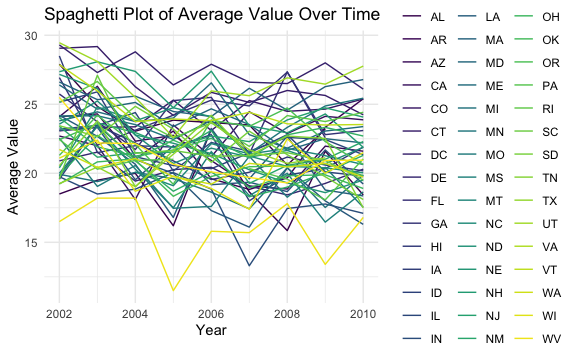
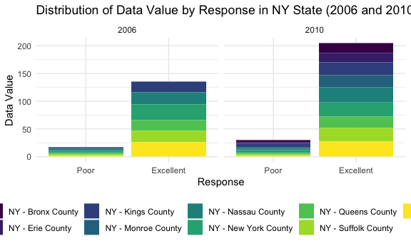
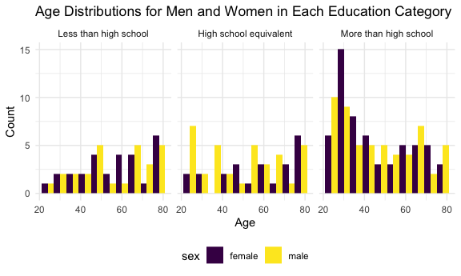

p8105_hw3_jy3360
================
Candice Yu
2023-10-05

    ## ── Attaching core tidyverse packages ──────────────────────── tidyverse 2.0.0 ──
    ## ✔ dplyr     1.1.3     ✔ readr     2.1.4
    ## ✔ forcats   1.0.0     ✔ stringr   1.5.0
    ## ✔ ggplot2   3.4.3     ✔ tibble    3.2.1
    ## ✔ lubridate 1.9.2     ✔ tidyr     1.3.0
    ## ✔ purrr     1.0.2     
    ## ── Conflicts ────────────────────────────────────────── tidyverse_conflicts() ──
    ## ✖ dplyr::filter() masks stats::filter()
    ## ✖ dplyr::lag()    masks stats::lag()
    ## ℹ Use the conflicted package (<http://conflicted.r-lib.org/>) to force all conflicts to become errors

# Problem 1

##### The goal is to do some exploration of this dataset. To that end, write a short description of the dataset, noting the size and structure of the data, describing some key variables, and giving illstrative examples of observations. Then, do or answer the following (commenting on the results of each):

``` r
library(p8105.datasets)
data("instacart")
```

###### 1.1 How many aisles are there, and which aisles are the most items ordered from?

``` r
aisles_number <- 
  instacart %>%
  group_by(aisle_id) %>%
  summarize(count_in_aisle = n()) %>%
  mutate(rank_of_aisle = min_rank(desc(count_in_aisle))) %>%
  arrange(rank_of_aisle)
```

<span style="color: blue;"><b>Solution 1.1:</b></span> There are 134
aisles and 83 is the aisle with the most items ordered from.

###### 1.2 Make a plot that shows the number of items ordered in each aisle, limiting this to aisles with more than 10000 items ordered. Arrange aisles sensibly, and organize your plot so others can read it.

``` r
aisles_number1.2 <- aisles_number %>%
  filter(count_in_aisle > 10000) 

aisles_number1.2 %>%
  ggplot(aes(x = aisle_id, y = count_in_aisle)) + 
  geom_point(alpha = 0.8) +
  labs(                                             
    title = "Number of Items Ordered in Each Aisle (Aisles with >10,000 items)",
    x = "Aisle ID",
    y = "Number of Items Ordered",
  ) 
```


###### 1.3 Make a table showing the three most popular items in each of the aisles “baking ingredients”, “dog food care”, and “packaged vegetables fruits”. Include the number of times each item is ordered in your table.

``` r
popular_items <- 
  instacart %>%
  filter(aisle == c("baking ingredients", "dog food care", "packaged vegetables fruits")) %>%
  group_by(aisle, product_name) %>%
  summarise(number_of_time = n()) %>%
  mutate(rank_of_time = min_rank(desc(number_of_time))) %>%
  arrange(rank_of_time) %>%
  filter(rank_of_time == c(1,2,3))
```

    ## `summarise()` has grouped output by 'aisle'. You can override using the
    ## `.groups` argument.

    ## Warning: There were 2 warnings in `filter()`.
    ## The first warning was:
    ## ℹ In argument: `rank_of_time == c(1, 2, 3)`.
    ## ℹ In group 1: `aisle = "baking ingredients"`.
    ## Caused by warning in `rank_of_time == c(1, 2, 3)`:
    ## ! longer object length is not a multiple of shorter object length
    ## ℹ Run `dplyr::last_dplyr_warnings()` to see the 1 remaining warning.

``` r
popular_items %>%
  knitr::kable() 
```

| aisle                      | product_name                                    | number_of_time | rank_of_time |
|:---------------------------|:------------------------------------------------|---------------:|-------------:|
| baking ingredients         | Light Brown Sugar                               |            157 |            1 |
| dog food care              | Organix Grain Free Chicken & Vegetable Dog Food |             14 |            1 |
| packaged vegetables fruits | Organic Baby Spinach                            |           3324 |            1 |
| baking ingredients         | Pure Baking Soda                                |            140 |            2 |
| dog food care              | Organix Chicken & Brown Rice Recipe             |             13 |            2 |
| packaged vegetables fruits | Organic Raspberries                             |           1920 |            2 |
| baking ingredients         | Organic Vanilla Extract                         |            122 |            3 |
| dog food care              | Original Dry Dog                                |              9 |            3 |
| packaged vegetables fruits | Organic Blueberries                             |           1692 |            3 |

###### 1.4 Make a table showing the mean hour of the day at which Pink Lady Apples and Coffee Ice Cream are ordered on each day of the week; format this table for human readers (i.e. produce a 2 x 7 table).

``` r
instacart %>%
  filter(product_name == c("Pink Lady Apples", "Coffee Ice Cream")) %>%
  select(product_name, order_dow, order_hour_of_day) %>%
  group_by(product_name, order_dow) %>%
  summarise(mean_order_hour_of_day = mean(order_hour_of_day)) %>%
  pivot_wider(
    names_from = order_dow,
    values_from = mean_order_hour_of_day
  ) %>%
  knitr::kable() 
```

    ## Warning: There was 1 warning in `filter()`.
    ## ℹ In argument: `product_name == c("Pink Lady Apples", "Coffee Ice Cream")`.
    ## Caused by warning in `product_name == c("Pink Lady Apples", "Coffee Ice Cream")`:
    ## ! longer object length is not a multiple of shorter object length

    ## `summarise()` has grouped output by 'product_name'. You can override using the
    ## `.groups` argument.

| product_name     |        0 |        1 |        2 |       3 |        4 |        5 |        6 |
|:-----------------|---------:|---------:|---------:|--------:|---------:|---------:|---------:|
| Coffee Ice Cream | 13.22222 | 15.00000 | 15.33333 | 15.4000 | 15.16667 | 10.33333 | 12.35294 |
| Pink Lady Apples | 12.25000 | 11.67857 | 12.00000 | 13.9375 | 11.90909 | 13.86957 | 11.55556 |

# Problem 2

###### First, do some data cleaning:

- format the data to use appropriate variable names;
- focus on the “Overall Health” topic
- include only responses from “Excellent” to “Poor”
  ????????????????????????????????????????
- organize responses as a factor taking levels ordered from “Poor” to
  “Excellent”

``` r
library(p8105.datasets)

brfss = brfss_smart2010 %>%
  janitor::clean_names() %>%
  filter(topic == "Overall Health") %>%
  filter(response == "Excellent" | response == "Poor") %>%
  mutate(response = factor(response, level = c("Poor", "Excellent")))
```

###### Using this dataset, do or answer the following (commenting on the results of each):

- In 2002, which states were observed at 7 or more locations? What about
  in 2010?
- Construct a dataset that is limited to Excellent responses, and
  contains, year, state, and a variable that averages the data_value
  across locations within a state.
- Make a “spaghetti” plot of this average value over time within a state
  (that is, make a plot showing a line for each state across years – the
  geom_line geometry and group aesthetic will help).
- Make a two-panel plot showing, for the years 2006, and 2010,
  distribution of data_value for responses (“Poor” to “Excellent”) among
  locations in NY State.

``` r
# In 2002, which states were observed at 7 or more locations?
brfss %>%
  filter(year == 2002) %>%
  group_by(locationabbr, locationdesc) %>%
  summarise(rep_location = n()) %>%
  group_by(locationabbr) %>%
  summarise(number_of_location = n()) %>%
  filter(number_of_location >6)
```

    ## `summarise()` has grouped output by 'locationabbr'. You can override using the
    ## `.groups` argument.

    ## # A tibble: 6 × 2
    ##   locationabbr number_of_location
    ##   <chr>                     <int>
    ## 1 CT                            7
    ## 2 FL                            7
    ## 3 MA                            8
    ## 4 NC                            7
    ## 5 NJ                            8
    ## 6 PA                           10

``` r
# In 2010, which states were observed at 7 or more locations?
brfss %>%
  filter(year == 2010) %>%
  group_by(locationabbr, locationdesc) %>%
  summarise(rep_location = n()) %>%
  group_by(locationabbr) %>%
  summarise(number_of_location = n()) %>%
  filter(number_of_location >6)
```

    ## `summarise()` has grouped output by 'locationabbr'. You can override using the
    ## `.groups` argument.

    ## # A tibble: 14 × 2
    ##    locationabbr number_of_location
    ##    <chr>                     <int>
    ##  1 CA                           12
    ##  2 CO                            7
    ##  3 FL                           41
    ##  4 MA                            9
    ##  5 MD                           12
    ##  6 NC                           12
    ##  7 NE                           10
    ##  8 NJ                           19
    ##  9 NY                            9
    ## 10 OH                            8
    ## 11 PA                            7
    ## 12 SC                            7
    ## 13 TX                           16
    ## 14 WA                           10

``` r
# Construct a dataset that is limited to Excellent responses, and contains, year, state, and a variable that averages the data_value across locations within a state. 
brfss_mean_data <- brfss %>%
  filter(response == "Excellent") %>%
  group_by(year, locationabbr) %>%
  summarise(mean_data_value = mean(data_value))
```

    ## `summarise()` has grouped output by 'year'. You can override using the
    ## `.groups` argument.

``` r
# Make a “spaghetti” plot of this average value over time within a state (that is, make a plot showing a line for each state across years – the geom_line geometry and group aesthetic will help).
brfss_mean_data %>%
  ggplot(aes(x = year, y = mean_data_value, color = locationabbr)) +
  geom_line() +
  labs(x = "Year", 
       y = "Average Value",
       title = "Spaghetti Plot of Average Value Over Time") +
  theme_minimal()
```

    ## Warning: Removed 3 rows containing missing values (`geom_line()`).



``` r
# Make a two-panel plot showing, for the years 2006, and 2010, distribution of data_value for responses (“Poor” to “Excellent”) among locations in NY State.

brfss %>%
  filter(year %in% c(2006, 2010), locationabbr == "NY") %>%
  ggplot(aes(x = response, y = data_value, fill = locationdesc)) +
  geom_bar(stat = "identity") +
  facet_wrap(~ year, nrow = 1) +  # Create two panels for 2006 and 2010
  labs(x = "Response", 
       y = "Data Value", 
       title = "Distribution of Data Value by Response in NY State (2006 and 2010)")
```



# Problem 3

###### Load, tidy, merge, and otherwise organize the data sets.

- Your final dataset should include all originally observed variables;
- exclude participants less than 21 years of age, and those with missing
  demographic data;
- and encode data with reasonable variable classes (i.e. not numeric,
  and using factors with the ordering of tables and plots in mind).

``` r
demographic <- read_csv("./data/nhanes_covar.csv", skip = 4) %>%
  janitor::clean_names() %>%
  filter(age > 20) %>%
  drop_na() %>%
  mutate(sex = factor(recode(sex, "1" = "male", "2" = "female")), 
         education = recode(education, `1` = "Less than high school", 
                            `2` =  "High school equivalent",
                            `3`  = "More than high school"),
         education = factor(education, levels = c("Less than high school", 
                                                  "High school equivalent", 
                                                  "More than high school")))
```

    ## Rows: 250 Columns: 5
    ## ── Column specification ────────────────────────────────────────────────────────
    ## Delimiter: ","
    ## dbl (5): SEQN, sex, age, BMI, education
    ## 
    ## ℹ Use `spec()` to retrieve the full column specification for this data.
    ## ℹ Specify the column types or set `show_col_types = FALSE` to quiet this message.

``` r
accelerometer <- read_csv("./data/nhanes_accel.csv")%>%
  janitor::clean_names() %>%
  pivot_longer(
    min1:min1440,
    names_to = "min",
    names_prefix = "min",
    values_to = "mims"
  )
```

    ## Rows: 250 Columns: 1441
    ## ── Column specification ────────────────────────────────────────────────────────
    ## Delimiter: ","
    ## dbl (1441): SEQN, min1, min2, min3, min4, min5, min6, min7, min8, min9, min1...
    ## 
    ## ℹ Use `spec()` to retrieve the full column specification for this data.
    ## ℹ Specify the column types or set `show_col_types = FALSE` to quiet this message.

``` r
mims <- left_join(demographic, accelerometer)
```

    ## Joining with `by = join_by(seqn)`

``` r
str(mims)
```

    ## tibble [328,320 × 7] (S3: tbl_df/tbl/data.frame)
    ##  $ seqn     : num [1:328320] 62161 62161 62161 62161 62161 ...
    ##  $ sex      : Factor w/ 2 levels "female","male": 2 2 2 2 2 2 2 2 2 2 ...
    ##  $ age      : num [1:328320] 22 22 22 22 22 22 22 22 22 22 ...
    ##  $ bmi      : num [1:328320] 23.3 23.3 23.3 23.3 23.3 23.3 23.3 23.3 23.3 23.3 ...
    ##  $ education: Factor w/ 3 levels "Less than high school",..: 2 2 2 2 2 2 2 2 2 2 ...
    ##  $ min      : chr [1:328320] "1" "2" "3" "4" ...
    ##  $ mims     : num [1:328320] 1.106 3.115 1.468 0.938 1.599 ...

###### Analysis of sex and education variables

- Produce a reader-friendly table for the number of men and women in
  each education category, and
- create a visualization of the age distributions for men and women in
  each education category.
- Comment on these items.

``` r
# Produce a reader-friendly table for the number of men and women in each education category
demographic %>%
  group_by(sex, education) %>%
  summarise(num_of_pp = n()) %>%
  pivot_wider(
    names_from = education,
    values_from = num_of_pp
  ) %>%
  knitr::kable()  
```

    ## `summarise()` has grouped output by 'sex'. You can override using the `.groups`
    ## argument.

| sex    | Less than high school | High school equivalent | More than high school |
|:-------|----------------------:|-----------------------:|----------------------:|
| female |                    28 |                     23 |                    59 |
| male   |                    27 |                     35 |                    56 |

``` r
# create a visualization of the age distributions for men and women in each education category

demographic %>%
  ggplot(aes(x = age, fill = sex)) +
  geom_histogram(binwidth = 6, position = "dodge")+
  facet_grid(.~ education) +
  labs(                                          
    title = "Age Distributions for Men and Women in Each Education Category",
    x = "Age",
    y = "Count"
  ) 
```


###### Traditional analyses of accelerometer data focus on the total activity over the day.

- Using your tidied dataset, aggregate across minutes to create a total
  activity variable for each participant.
- Plot these total activities (y-axis) against age (x-axis);
- your plot should compare men to women and have separate panels for
  each education level.
- Include a trend line or a smooth to illustrate differences.
- Comment on your plot.

``` r
# Using your tidied dataset, aggregate across minutes to create a total activity variable for each participant.
mims_aggregated <- mims %>%
  group_by(seqn) %>%
  summarise(activity = sum(mims)) %>%
  left_join(demographic)
```

    ## Joining with `by = join_by(seqn)`

``` r
# Plot these total activities (y-axis) against age (x-axis); 
mims_aggregated %>%
  ggplot(aes(x = age, y = activity, color = sex)) +   
  geom_point() +
  facet_grid(.~ education) +                                     
  geom_smooth(se = FALSE) +
  labs(                                          
    title = "Total Activities against Age for each Education Level",
    x = "Age",
    y = "Activity"
  ) 
```

    ## `geom_smooth()` using method = 'loess' and formula = 'y ~ x'



###### Accelerometer data allows the inspection activity over the course of the day.

- Make a three-panel plot that shows the 24-hour activity time courses
  for each education level and use color to indicate sex.
- Describe in words any patterns or conclusions you can make based on
  this graph;
- including smooth trends may help identify differences.

``` r
# Plot these total activities (y-axis) against age (x-axis); 

mims %>%
  group_by(seqn, sex, age, education, min)
```

    ## # A tibble: 328,320 × 7
    ## # Groups:   seqn, sex, age, education, min [328,320]
    ##     seqn sex     age   bmi education              min    mims
    ##    <dbl> <fct> <dbl> <dbl> <fct>                  <chr> <dbl>
    ##  1 62161 male     22  23.3 High school equivalent 1     1.11 
    ##  2 62161 male     22  23.3 High school equivalent 2     3.12 
    ##  3 62161 male     22  23.3 High school equivalent 3     1.47 
    ##  4 62161 male     22  23.3 High school equivalent 4     0.938
    ##  5 62161 male     22  23.3 High school equivalent 5     1.60 
    ##  6 62161 male     22  23.3 High school equivalent 6     0.145
    ##  7 62161 male     22  23.3 High school equivalent 7     2.10 
    ##  8 62161 male     22  23.3 High school equivalent 8     0.509
    ##  9 62161 male     22  23.3 High school equivalent 9     1.63 
    ## 10 62161 male     22  23.3 High school equivalent 10    1.20 
    ## # ℹ 328,310 more rows

``` r
mims$hour <- rep(rowsum(mims$mims, rep(1:5472, each=60)), each = 60)
```
