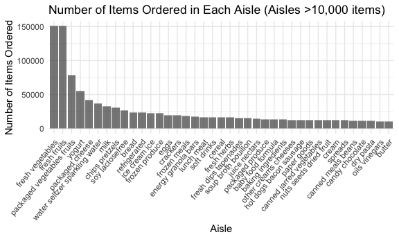

p8105_hw3_jy3360
================
Candice Yu
2023-10-05

    ## ── Attaching core tidyverse packages ──────────────────────── tidyverse 2.0.0 ──
    ## ✔ dplyr     1.1.3     ✔ readr     2.1.4
    ## ✔ forcats   1.0.0     ✔ stringr   1.5.0
    ## ✔ ggplot2   3.4.3     ✔ tibble    3.2.1
    ## ✔ lubridate 1.9.2     ✔ tidyr     1.3.0
    ## ✔ purrr     1.0.2     
    ## ── Conflicts ────────────────────────────────────────── tidyverse_conflicts() ──
    ## ✖ dplyr::filter() masks stats::filter()
    ## ✖ dplyr::lag()    masks stats::lag()
    ## ℹ Use the conflicted package (<http://conflicted.r-lib.org/>) to force all conflicts to become errors

# Problem 1

##### The goal is to do some exploration of this dataset. To that end, write a short description of the dataset, noting the size and structure of the data, describing some key variables, and giving illstrative examples of observations. Then, do or answer the following (commenting on the results of each):

``` r
library(p8105.datasets)
data("instacart")
```

###### 1.1 How many aisles are there, and which aisles are the most items ordered from?

``` r
aisles_number <- 
  instacart %>%
  group_by(aisle_id) %>%
  summarize(count_in_aisle = n()) %>%
  mutate(rank_of_aisle = min_rank(desc(count_in_aisle))) %>%
  arrange(rank_of_aisle)
```

<span style="color: blue;"><b>Solution 1.1:</b></span> There are 134
aisles and 83 is the aisle with the most items ordered from.

###### 1.2 Make a plot that shows the number of items ordered in each aisle, limiting this to aisles with more than 10000 items ordered. Arrange aisles sensibly, and organize your plot so others can read it.

``` r
aisles_number1.2 <- aisles_number %>%
  filter(count_in_aisle > 10000) 

aisles_number1.2 %>%
  ggplot(aes(x = aisle_id, y = count_in_aisle)) + 
  geom_point(alpha = 0.8) +
  labs(                                             
    title = "Number of Items Ordered in Each Aisle (Aisles with >10,000 items)",
    x = "Aisle ID",
    y = "Number of Items Ordered",
  ) 
```



###### 1.3 Make a table showing the three most popular items in each of the aisles “baking ingredients”, “dog food care”, and “packaged vegetables fruits”. Include the number of times each item is ordered in your table.

``` r
popular_items <- 
  instacart %>%
  filter(aisle == c("baking ingredients", "dog food care", "packaged vegetables fruits")) %>%
  group_by(aisle, product_name) %>%
  summarise(number_of_time = n()) %>%
  mutate(rank_of_time = min_rank(desc(number_of_time))) %>%
  arrange(rank_of_time) %>%
  filter(rank_of_time == c(1,2,3))
```

    ## `summarise()` has grouped output by 'aisle'. You can override using the
    ## `.groups` argument.

    ## Warning: There were 2 warnings in `filter()`.
    ## The first warning was:
    ## ℹ In argument: `rank_of_time == c(1, 2, 3)`.
    ## ℹ In group 1: `aisle = "baking ingredients"`.
    ## Caused by warning in `rank_of_time == c(1, 2, 3)`:
    ## ! longer object length is not a multiple of shorter object length
    ## ℹ Run `dplyr::last_dplyr_warnings()` to see the 1 remaining warning.

``` r
popular_items %>%
  knitr::kable() 
```

| aisle                      | product_name                                    | number_of_time | rank_of_time |
|:---------------------------|:------------------------------------------------|---------------:|-------------:|
| baking ingredients         | Light Brown Sugar                               |            157 |            1 |
| dog food care              | Organix Grain Free Chicken & Vegetable Dog Food |             14 |            1 |
| packaged vegetables fruits | Organic Baby Spinach                            |           3324 |            1 |
| baking ingredients         | Pure Baking Soda                                |            140 |            2 |
| dog food care              | Organix Chicken & Brown Rice Recipe             |             13 |            2 |
| packaged vegetables fruits | Organic Raspberries                             |           1920 |            2 |
| baking ingredients         | Organic Vanilla Extract                         |            122 |            3 |
| dog food care              | Original Dry Dog                                |              9 |            3 |
| packaged vegetables fruits | Organic Blueberries                             |           1692 |            3 |

###### 1.4 Make a table showing the mean hour of the day at which Pink Lady Apples and Coffee Ice Cream are ordered on each day of the week; format this table for human readers (i.e. produce a 2 x 7 table).

``` r
instacart %>%
  filter(product_name == c("Pink Lady Apples", "Coffee Ice Cream")) %>%
  select(product_name, order_dow, order_hour_of_day) %>%
  group_by(product_name, order_dow) %>%
  summarise(mean_order_hour_of_day = mean(order_hour_of_day)) %>%
  pivot_wider(
    names_from = order_dow,
    values_from = mean_order_hour_of_day
  ) %>%
  knitr::kable() 
```

    ## Warning: There was 1 warning in `filter()`.
    ## ℹ In argument: `product_name == c("Pink Lady Apples", "Coffee Ice Cream")`.
    ## Caused by warning in `product_name == c("Pink Lady Apples", "Coffee Ice Cream")`:
    ## ! longer object length is not a multiple of shorter object length

    ## `summarise()` has grouped output by 'product_name'. You can override using the
    ## `.groups` argument.

| product_name     |        0 |        1 |        2 |       3 |        4 |        5 |        6 |
|:-----------------|---------:|---------:|---------:|--------:|---------:|---------:|---------:|
| Coffee Ice Cream | 13.22222 | 15.00000 | 15.33333 | 15.4000 | 15.16667 | 10.33333 | 12.35294 |
| Pink Lady Apples | 12.25000 | 11.67857 | 12.00000 | 13.9375 | 11.90909 | 13.86957 | 11.55556 |

# Problem 2

##### This problem uses the BRFSS data. DO NOT include this dataset in your local data directory; instead, load the data from the p8105.datasets package.

###### First, do some data cleaning:

###### - format the data to use appropriate variable names;

###### - focus on the “Overall Health” topic

###### - include only responses from “Excellent” to “Poor”

###### - organize responses as a factor taking levels ordered from “Poor” to “Excellent”

Using this dataset, do or answer the following (commenting on the
results of each):

In 2002, which states were observed at 7 or more locations? What about
in 2010? Construct a dataset that is limited to Excellent responses, and
contains, year, state, and a variable that averages the data_value
across locations within a state. Make a “spaghetti” plot of this average
value over time within a state (that is, make a plot showing a line for
each state across years – the geom_line geometry and group aesthetic
will help). Make a two-panel plot showing, for the years 2006, and 2010,
distribution of data_value for responses (“Poor” to “Excellent”) among
locations in NY State. Problem 3 Accelerometers have become an appealing
alternative to self-report techniques for studying physical activity in
observational studies and clinical trials, largely because of their
relative objectivity. During observation periods, the devices can
measure MIMS in a short period; one-minute intervals are common. Because
accelerometers can be worn comfortably and unobtrusively, they produce
around-the-clock observations.

This problem uses accelerometer data collected on 250 participants in
the NHANES study. The participants’ demographic data can be downloaded
here, and their accelerometer data can be downloaded here. Variables
\*MIMS are the MIMS values for each minute of a 24-hour day starting at
midnight.

Load, tidy, merge, and otherwise organize the data sets. Your final
dataset should include all originally observed variables; exclude
participants less than 21 years of age, and those with missing
demographic data; and encode data with reasonable variable classes
(i.e. not numeric, and using factors with the ordering of tables and
plots in mind).

Produce a reader-friendly table for the number of men and women in each
education category, and create a visualization of the age distributions
for men and women in each education category. Comment on these items.

Traditional analyses of accelerometer data focus on the total activity
over the day. Using your tidied dataset, aggregate across minutes to
create a total activity variable for each participant. Plot these total
activities (y-axis) against age (x-axis); your plot should compare men
to women and have separate panels for each education level. Include a
trend line or a smooth to illustrate differences. Comment on your plot.

Accelerometer data allows the inspection activity over the course of the
day. Make a three-panel plot that shows the 24-hour activity time
courses for each education level and use color to indicate sex. Describe
in words any patterns or conclusions you can make based on this graph;
including smooth trends may help identify differences.
